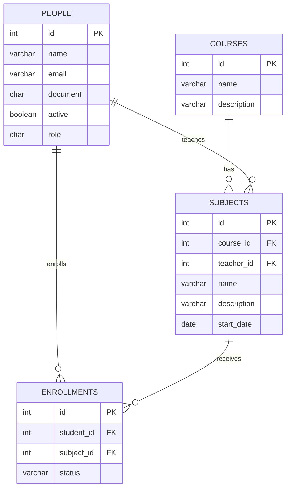

# Enrollment Management API

Enrollment Management API é uma API RESTful desenvolvida para gerenciar o processo de matrículas em um ambiente acadêmico. O sistema permite o cadastro e a manipulação de Cursos, Matérias, Alunos e Matrículas.

## Funcionalidades

A Enrollment Management API oferece funcionalidades completas para gerenciamento acadêmico, incluindo:

* **Cursos:** criação de novos cursos, listagem de todos os cursos, consulta por ID, atualização e exclusão de cursos. É possível também listar todas as matérias associadas a um curso específico.
* **Matérias:** criação de matérias vinculadas a um curso e a um professor, listagem de todas as matérias, consulta por ID, atualização e exclusão de matérias. Também é possível listar todas as matrículas associadas a uma matéria.
* **Pessoas:** cadastro de novas pessoas, listagem de todos os registros, consulta por ID, atualização e exclusão. Para professores, é possível listar as matérias que lecionam; para alunos, listar todas as matrículas.
* **Matrículas:** criação de matrículas vinculadas a um aluno e uma matéria, listagem de todas as matrículas (com filtro por status), consulta por ID, atualização e gerenciamento do status da matrícula através das ações: aprovar, reprovar ou trancar.

## Diagrama de Entidades



## Tecnologias Utilizadas

Abaixo estão as principais tecnologias e bibliotecas utilizadas no desenvolvimento da API:

| Tecnologia          | Link                                                                  |
| :------------------ | :-------------------------------------------------------------------- |
| Java 21             | [https://www.oracle.com/java/](https://www.oracle.com/java/)          |
| Spring Boot 3.4.5   | [https://spring.io/projects/spring-boot](https://spring.io/projects/spring-boot) |
| PostgreSQL          | [https://www.postgresql.org/](https://www.postgresql.org/)            |
| H2 Database         | [https://www.h2database.com/](https://www.h2database.com/)            |
| Spring Data JPA     | [https://spring.io/projects/spring-data-jpa](https://spring.io/projects/spring-data-jpa) |
| Flyway              | [https://flywaydb.org/](https://flywaydb.org/)                        |
| Lombok              | [https://projectlombok.org/](https://projectlombok.org/)              |
| Maven               | [https://maven.apache.org/](https://maven.apache.org/)                |          |           |           |

## Como Executar o Projeto

Siga os passos abaixo para executar a API localmente.

### Pré-requisitos

Antes de começar, você vai precisar ter instalado em sua máquina:
* [JDK 21](https://www.oracle.com/java/technologies/downloads/#java21) ou superior
* Um servidor de banco de dados [PostgreSQL](https://www.postgresql.org/download/) rodando localmente

### 1. Clonar o Repositório

```bash
git clone https://github.com/guilherme-eira/enrollment-management-api.git
cd enrollment-management-api
```

### 2. Configurar o Banco de Dados

Você precisa criar um banco de dados para a aplicação. Existem duas maneiras de fazer isso:

#### a) Usando o pgAdmin (interface gráfica)
1. Abra o **pgAdmin** e conecte-se ao seu servidor PostgreSQL local.
2. No painel lateral, clique com o botão direito em **Databases** e selecione **Create → Database**.
3. Na janela que abrir, preencha o campo **Database** com o nome: `enrollment_manager`
4. Selecione o **Owner** (usuário que terá permissão de acesso) e clique em **Save**.
5. O banco de dados `enrollment_manager` aparecerá na lista de databases do servidor.

#### b) Usando o terminal com `psql` (linha de comando)
1. Abra o terminal e conecte-se ao PostgreSQL:

    ```bash
    psql -U seu_usuario
    ```
2. No prompt do PostgreSQL, execute o comando:

    ```sql
    CREATE DATABASE enrollment_manager;
    ```
3. Para confirmar que o banco foi criado, use:

    ```sql
    \l
    ```
Agora o banco de dados `enrollment_manager` está pronto para ser usado pela aplicação.

### 3. Configurar o `application.properties`

Dentro do diretório `src/main/resources`, crie ou edite o arquivo `application.properties`. Você tem duas opções para configurar a conexão com o banco de dados:

#### a) Configuração direta
Substitua os valores pelas suas credenciais do PostgreSQL:

```properties
# URL de conexão com o seu banco de dados PostgreSQL
spring.datasource.url=jdbc:postgresql://localhost:5432/enrollment_manager

# Usuário do banco de dados
spring.datasource.username=seu_usuario_aqui

# Senha do banco de dados
spring.datasource.password=sua_senha_aqui

# Driver do PostgreSQL
spring.datasource.driver-class-name=org.postgresql.Driver

# Configurações do Hibernate/JPA
spring.jpa.hibernate.ddl-auto=update
spring.jpa.show-sql=true
spring.jpa.format-sql=true
hibernate.dialect=org.hibernate.dialect.PostgreSQLDialect
```
#### b) Usando variáveis de ambiente (recomendado)
Você também pode deixar o arquivo genérico e configurar as credenciais via variáveis de ambiente, substituindo os valores diretos por placeholders:

```properties
spring.datasource.url=${DB_URL}
spring.datasource.username=${DB_USER}
spring.datasource.password=${DB_PASSWORD}
spring.datasource.driver-class-name=org.postgresql.Driver
hibernate.dialect=org.hibernate.dialect.PostgreSQLDialect
spring.jpa.show-sql=true
spring.jpa.format-sql=true
```
Nesse caso, você precisa definir as variáveis de ambiente no seu sistema:

- **DB_URL** → URL do banco de dados (jdbc:postgresql://localhost:5432/enrollment_manager)
- **DB_USER** → Usuário do PostgreSQL
- **DB_PASSWORD** → Senha do PostgreSQL

### 4. Executar a Aplicação

Como o Maven já vem embutido via Spring Boot, você pode executar a aplicação diretamente pela IDE:

- **IntelliJ:** clique com o botão direito na classe principal `EnrollmentManagerApplication` e selecione **Run**.
- **Eclipse:** clique com o botão direito na classe principal e selecione **Run As → Spring Boot App**.

Alternativamente, você pode rodar no terminal usando Maven Wrapper:

```bash
./mvnw spring-boot:run
```
Ou, se tiver Maven instalado globalmente:

```bash
mvn spring-boot:run
```
A API estará rodando em ```http://localhost:8080```.
